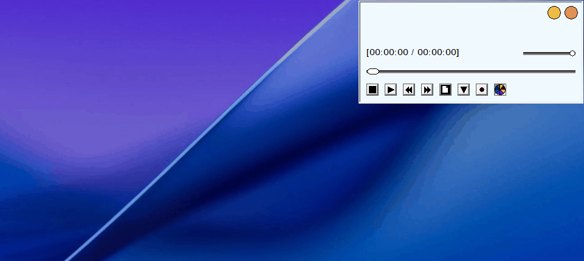

# 📌 Bittypak 
Windows Legacy API와 COM을 이용한 뮤직 플레이어입니다. 
이 프로젝트는 MIT 라이선스 하에 제공되어 누구나 자유롭게 사용, 수정, 배포할 수 있습니다. 개인 또는 상업적 용도로도 활용이 가능합니다. 
  
## 📝 Description 
"Bittypak"은 wav 및 mp3 포맷을 지원하는 뮤직 플레이어입니다. 
시스템과 관련된 기능을 일부 사용하고 있으며 사용자가 작업한 내용을 기록하기 위한 용도로 레지스트리를 활용합니다. 
예를 들어, 프로그램이 종료되기 전 마지막 위치나 사용자가 불러온 미디어 파일을 기억해두기 위해 레지스트리에 데이터와 키를 추가하여 관리합니다. 
이외에 시스템 관련 설정은 없으며 DRAG & DROP을 지원합니다. 
 
프로그램은 스크롤바와 9개의 버튼 컨트롤로 구성됩니다. 
버튼에는 여러가지 그림이 그려져 있는데 해당 버튼이 가진 기능을 보여줍니다. 
 
이는 차례대로 다음과 같습니다. 
 
- 중단 
- 재생/정지 
- 이전 곡 
- 다음 곡 
- 파일 추가 
- 플레이리스트 항목 보이기/숨기기 
- 녹음 시작/정지 
- 녹음 타이머 설정(v1.0.2) 
- 스펙트럼 그리기 활성화/비활성화 
  
## 🚀 Getting Started 
### 🔧 Dependencies 
- Windows 10 이상 
  
### 📥 Installing 
[Releases](https://github.com/stdsic/Bittypak/releases) 페이지에서 최신 버전을 확인하실 수 있습니다. 
압축 해제 후 `Bittypak.exe` 또는 `BittypakInstaller.exe`를 실행합니다. 
설치 파일(BittypakInstaller.exe)을 다운로드한 경우 안내에 따라 안전하게 실행 파일(Bittypak.exe)을 설치하시면 됩니다. 
 
### ▶️ Executing program 
- Bittypak.exe 
  
## ❓ Help 
- 스크롤바로 재생 구간을 조정할 때에는 반드시 마우스를 이용해야 합니다. 현재 버전에서는 키보드를 지원하지 않습니다. 
- 알려진 버그(Known bug)가 존재하며 추후 업데이트될 예정입니다. 자세한 내용은 Releases 페이지에서 확인할 수 있습니다. 
  
## 👤 Authors 
- stdsic — @https://github.com/stdsic/Bittypak 
  
## 📚 Version History 
- 1.0.3 
  - 타이머 오류 수정 
- 1.0.2 
  - 녹음 타이머 기능 추가 
- 1.0.1 
  - 화면 절전 방지 기능 추가(beta) 
- 1.0.0 
  - 최초 릴리스(beta) 
  
## 🧾 License 
이 프로젝트는 [MIT License](LICENSE)로 라이선스되어 있습니다. 
자세한 정보는 LICENSE 파일을 참고하시기 바랍니다. 
  
## 📄 Assets Attribution 
이 프로젝트는 Flaticon의 Summer Pack 아이콘을 사용합니다. 
- 이 아이콘은 Graphix's Art가 제작하였습니다(`https://www.flaticon.com/kr/authors/graphixs-art`). 
- Flaticon 기본 라이선스에 따라 라이선스가 부여됩니다. 
- 아이콘은 PNG 형식으로 다운로드한 후 프로젝트에서 사용하기 위해 ICO 형식으로 변환하였습니다. 
- 출처: <a href="https://www.flaticon.com/kr/packs/summer-875" title="summer icons">Summer icons created by Graphix's Art - Flaticon</a>
